# Chrome DevTools

#### 作者：刘冉冉

#### 邮箱：liuranran@haomo-studio.com

目前主要的js的调试工具，分别有：

* #### JSLint

  ```
  它是由当今世界web开发领域最知名的技术权威之一--Douglas Crockford所创建的一个基于web的工具。你需要做的就是复制粘贴代码到JSLint的在线编辑器上，就可以：突出显示代码中的错误确保语法简洁又符合标准。指出js常见的类型错误。能指出类似于单引号双引号，还有代码缩进、空格等。
  官方网站：http://www.jslint.com/
  ```

* #### JSLitmus

  ```
  如果你比较在意js应用程序的性能，JSLitmus就是不错的选择，他可以帮助你创建你自己的js基准测试，以便于你权衡app开发各个阶段的性能。

  一个测试非循环函数的最简单的形式是这样的：
  JSLitmus.test（’非循环测试‘，function（）{
    //你的测试代码放在这里
  }）;

  官方网站：http://www.broofa.com/Tools/JSLitmus/
  ```

* #### Write Code Online

  ```
  它是一个全功能的js编辑器，他操作简单易于使用，并且几乎可以立马指出bug，对于大型应用程序而言，是一个不可或缺的得力助手。
  还有专门针对javascript的在线编辑器，js.do 他可以直接看到js运行的结果
  ```

* #### JS Bin

  ```
  这是一个较早出现的Javascript在线调试环境。

  它分成Javascript、html和"效果预览"三个区域，你可以自行勾选显示哪些区域。它没有独立的CSS代码区，CSS代码必须嵌入html代码，
  这点很不方便。

  它支持加载常用的Javascript库。除此以外，其他特色不多。

  网址：http://jsbin.com
  ```

* #### jsFiddle

  ```
  它的默认界面分成5个区域，左边是参数设置，右边依次是HTML、Javascript、CSS和"效果预览区"。

  网址：http://jsfiddle.net/
  ```

* #### Tinkerbin

  ```
  Tinkerbin很像jsFiddle，也是分成HTML、Javascript、CSS和"效果预览区"。它的特点在于，你可以选择某种代码独占整个编辑区，
  这样就增大了代码编辑的可视空间。另外，它可以实时显示代码运行结果，这是jsFiddle不支持的。
  这是目前最好使的在线web开发设计工具之一。他允许你在同一个web应用程序中测试html，css和js。
  使用它之所以在测试js代码片段对html和css的影响上面显得更为便捷，是因为能看到即时结果。
  能够在线调试并且方便在线与其他开发人员沟通代码和运行效果。

  网址：http://tinkerbin.com/
  ```


还有各种主流浏览器都有自己的调试工具，这里分别介绍一下：

```
   1 、IE浏览器
      虽然IE不像FireFox和Chrome那样提供多种插件，
但是对于这个目前世界上使用人数最多的浏览器而言，DebugBar是最好的前端调试工具之一。他涵盖了几乎所有你需要的功能：Dom检查Cookie检查Js调试。
      DegbugBar官方网站：http://www.debugbar.com/
   2、FireFox火狐浏览器
      安装Firebug 。点击工具->web开发者->获取更多工具->找到小虫子，添加到firefox即可。
      此时浏览器右下方会出现一个小虫子。它是中文版的界面。
      通过查看源代码的方法，无法看到由js动态生成的html结构，这里我们可以通过Firebug来查看，选中body节点，按下“编辑”，即可输出页面上源文件的代码以及动态生成的代码。还有一个简单的方法，选中你要查看的页面元素，然后在右键菜单中选择“查看选中部分源代码”
      Firecookie是基于Firebug的cookie调试工具，可以到网上下载一个安装上，安装好之后，Firebug中会多出一个“cookie”面板，你可以为需要调试的页面添加、删除、修改cookie信息。
   3、chrome浏览器
      使用F12打开调试工具，谷歌浏览器有自带的调试工具，所以不需要下载。本文会在后面着重介绍讲解。
   4、Safari浏览器
      Safari是唯一采用高级彩色管理、以最准确的色彩显示网络图片的浏览器，是苹果计算机的最新操作系统中的浏览器。
      调试工具打开方式：打开Safari浏览器浏览器之后，选择偏好设置，找到高级，勾选底部的“在菜单栏中显示“开发”菜单”，勾选完成之后，在浏览器菜单栏中会显示“开发”的选项，然后点击“开发”，在弹出下拉的菜单中进行选择“显示网页检查器”选项，这样就打开了调试工具，功能同其他调试工具类似。
   5、Opera浏览器
      Opera蜻蜓（Dragonfly）是Opera软件公司提供的调试工具。这款调试工具可以立马看到修改css和js后的结果检查错误，更快的找到他们的根源
      其他浏览器也正在不断改善以媲美Opera Dragonfly，但是就目前它对web开发人员而言依然是最好的测试工具之一。
      官方网站：http://www.opera.com/dragonfly/
```

现在使用率高的就是firebug和chrome devtools，对比给出结论：

* 都支持拖拽dom，有时候改布局神马的很方便
* chrome可以方便得修改user-agent，调整页面宽高，调试手机页面很方便，这个是chrome的一个插件，可以在chrome商店安装

  user-agent是什么，简单说明一下：它建成UA，是一种标识，这个标识用来向访问的网站提供你所使用的浏览器类型及版本，操作系统及版本，浏览器内核等信息。通过这个标识，网站可以显示不同的排版等。例如用手机访问谷歌和用电脑访问谷歌是不一样的，这些是谷歌根据访问者的UA来进行判断的。


* chrome不支持的css属性会用一个叹号标识出来，firebug会把他直接省略，比如ie的hacks

  本文主要介绍chrome中的chrome devtools的使用

  这是一套内置于谷歌浏览器的网页制作和调试工具。得益于Google V8的快速，相对其他的调试工具，他对HTML5和CSS3的支持也比较完善，无论是流畅性还是呈现的效果，都是比较出色的。而且主要是现在的Chrome的插件也非常的丰富。所以推荐使用。

  下图是界面  
  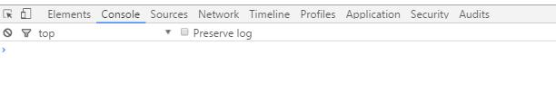

  ### 我们从头开始

  * 模拟整个网站不同的屏幕大小和分辨率  简而言之 就是可以通过它来调整手机端页面，以及精确的模拟设备输入的触摸事件


* ### Elements

  ```
  Elements面板的功能都是围绕DOM的，你可以看到整个DOM的结构，包括DOM的属性，样式，事件等等。

  1 .当鼠标在DOM树上的节点滑过时，如果该节点在整个页面中是可见的，
     你可以看到一个指向该元素位置的tip（如果看不到元素，tip的箭头会指向其所在的方向）
  2 .鼠标选中节点后，该节点会高亮，而且会在下面的style，EventListeners，DOM Breakpoints，Properties
     面板中显示所选中的节点对应的信息 同时会显示当前节点的所有父辈节点，直到html 
  3 .鼠标在节点（非文本节点）上右键，会出现一份菜单：
     （1）Add attribute：添加属性，比如添加title属性
     （2）Edit attribute：编辑属性（在节点的属性上右键才出现这项）
     （3）Force element state：使元素处于某种伪类状态，可选四种：
          ：active->选定状态
          ：hover->鼠标移到元素上的状态
          ：visited->已经访问过的状态
          ：focus->获取焦点状态
          这些状态通常用来调试不同状态瞎的css样式
     （4）Edit as HTML：编辑节点，用于编辑的文本框在失去焦点后结束编辑（快捷键为F2）
     （5）Copy as HTML:复制HTML;
     （6）Copy css path：复制css路径，类似当前节点的选择器；
     （7）Copy XPath：复制XPath；
     （8）Delete node：删除节点；（快捷键为del）
     （9）Inspect DOM properties：在console（会自动打开drawer中的console面板）中显示当前节点对象
     （10）Break on：
          Subtree modifications->子树修改时打断；
          Attributes modifications->节点属性修改时打断；
          Node removal->节点移除时打断；
     （11）Scroll into view：当前节点不在视口中时，页面滚动至节点出现在视口；
     （12）Word wrap：节点过长时是否换行，勾上->换行；不勾->不换行，出现滚动条；

      有几个很方便的快捷键：

      1、在dom上面使用方向键很快 上下导航 左右键收起展开
      2、H键快速隐藏dom 效果相当于给dom加上了visibilyty：hidden效果有别于display：none；
      3、Enter快速编辑属性
      4、鼠标右击使用各类方法
  ```

  下面介绍的Elements子面板功能都时基于已选中DOM节点。  
  如图：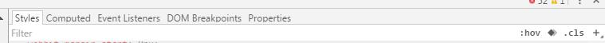

  ##### style面板（修改样式能即时看到效果）

  在颜色预览中使用Shift + Click ，可以在rgba, hsl 和 hexadecimal 这三种格式中改变。  
  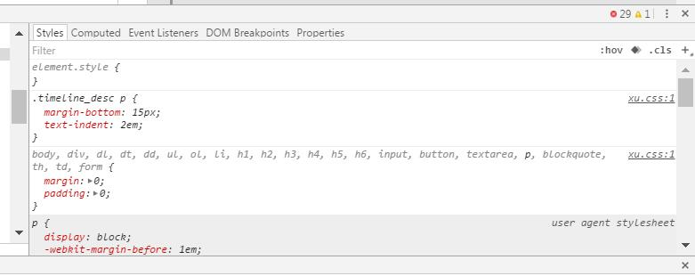

  ##### Computed面板（盒子模型由内而外对应的是元素的：content，padding，border，margin）

  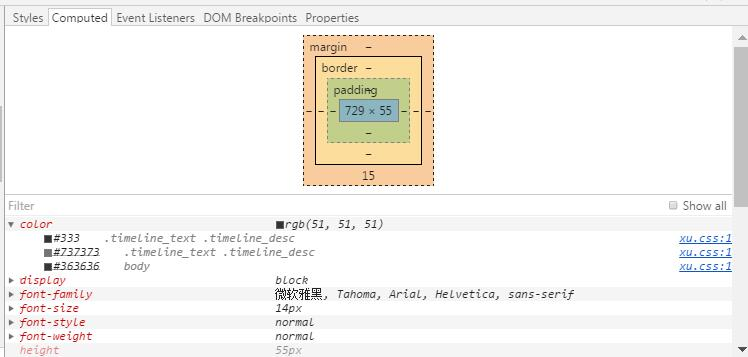

  ##### Event Listeners面板

  展开对应的事件类型后，选中元素绑定的事件  
  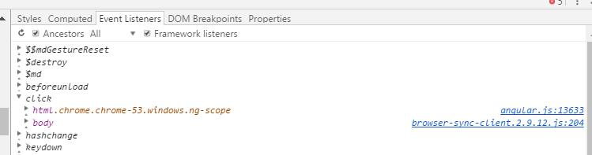

  ##### DOM Breakpoints

  展开对应的事件类型后，可以看到在对应dom上绑定的事件详情，以及源文件；  
  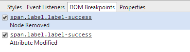

  ##### Properties

  主要是显示当前DOM的原型链，也就是当前DOM都继承自那些类；

* ### Console

  在js中输出

  ```
  小技巧：
  1、在element中选中dom，在console中输入$0,获取的就是当前选中的dom
  2、可搭配copy（$0）来复制代码 
  3、如果想对执行的代码进行耗时测试，可以使用console.time()和console.timeEnd();将要执行的代码放在这两个console中间。
  4、如果想查看某个函数被调用几次。可以在这个函数中console.trace();
  5、按esc退出console
  ```

* ### Sources

  在这里你可以看到页面加载的资源、图片、css、js等，他们是按照来源来分类的。  
  你可以在代码中添加断点，单步调试，以及单步调试过程中查看内存中的对象  
  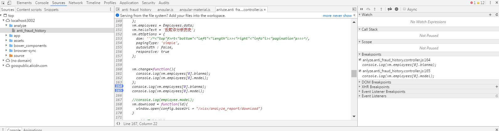

  Sources的界面分为三个部分。左边的内容源，包括页面中的各种资源。中间主区域用于展示左边资源文件的内容。右边是调试功能区。下面分别来介绍：

  * 左边内容区中的sources就是页面本身包含的各种资源，他是按照页面中出现的域来组织的，异步加载的js文件，在加载后也会出现在这里。

    内容区中的Content scripts是浏览器的一种扩展程序，他是按照扩展的id来组织的，实际也是嵌入的页面中的资源。他们也可以读写dom。如果没安装任何扩展，这里就没有任何东西。

  * 中间的区域展示文件的代码

  * 右边的调试功能区，上面一排按钮分别是暂停/继续、单步执行、单步跳入、单步跳出、禁用/启用所有断点。

    #### Sources的功能区按钮：

  * ##### Breakpoints所有的断点会在这里呈现

    在源代码上设置断点，通过左边的内容源，打开对应的js文件，鼠标单击文件的行号就可以设置和删除断点。

    添加的每个断点都会出现在breakpoints列表中，点击列表中的断点就会定位到内容区的断点上，快速定位断点很方便。

    对于每个已经添加的断点都有两种状态：激活和禁用。刚添加的断点都是激活状态，禁用状态就是保留断点但临时取消该断点功能。在Breakpoints列表中每个断点前面都有个复选框，取消选中就将禁用该断点。断点位置的右键菜单中也可以禁用断点。也可以在右侧功能区上面按钮临时禁用所有已添加的断点，再点一下恢复原状态。

  * ##### Call Stack调用栈

    调用栈（call stack）：在断点停下来时，右侧调试区的Call Stack会显示当前断st点所处的方法调用栈，比如有一个函数g（）其中又调用了函数f（），而我在f（）中设置了一个断点，那么我在console中执行函数g（）的时候会触发断点。然后调用栈中的显示就是上面是f（），下面是g（）。

    调用栈中的每一层叫做一个frame，点击每个frame可以跳到该frame的调用点上。还可以在frame上右键执行Restart Frame，断点就会跳到f（）的开头重新执行，contetxt中的变量值也会还原。这样结合变量修改和编辑代码等功能，就可以在当前frame中反复进行调试，而不用刷新页面重新触发断点了。

  * ##### Scope 查看此时局部变量和全局变量的值

    在断点调试时，可以在断点上选择想要查看的变量或表达式，然后右键菜单执行“Evaluate in Console”，此时 就可以在下面单独打开一个console，在这里就可以看到该表达式的当前的值了。

  * ##### Dom Breakpoints在dom上设置断点

    有时候需要监听某个dom被修改情况，那么我们可以直接在dom上设置断点，  
    在相应的dom元素上右键选择Break on这里有三种情况的断点：

    * 子节点修改（subtree modifications）
    * 自身属性修改（attributes modifications）
    * 自身节点被删除（node removal）

    选中之后，sources panel中右侧的Dom Breakpoints列表中就会出现该dom断点，一旦执行到要对该dom做相应修改时，代码就会在那里停下来

  * ##### XHR Breakpoints

    点击后面的+ 并输入url包含的字符串即可监听该url的ajax请求，输入内容就相当于url的过滤器。如果什么都不填 就监听所有的XHR请求。一旦XHR调用触发时就会在request。send（）的地方中断。

  * ##### Event Listener

    按事件类型触发断点 这里列出了各种可能的事件类型。勾选对应的事件类型，当触发了该类型的事件的js代码时就会自动中断。

  * ##### 其他：

    * ##### 条件断点：

      在断点位置的右键菜单中选择“Edit Breakpoint”可以设置触发断点的条件，就是写一个表达式，表达式为true时才触发断点。此时断点变为黄色。

    * ##### 异常时断点：

      在界面下方能看到按钮，他是设置程序运行时遇到异常时是否中断的开关。默认遇到异常不中断。点击该按钮会变成蓝色，意思是遇到所有异常都会中断，包括已捕获的情况。 下面会出现一条信息Pause on caught exceptions 勾选的意思就是  仅在出现未捕获的异常时才中断。两者的区别：  
      例如：try{  
       throw 'a exception'  
       //抛出异常  
      }catch\(e\){  
       console.log\(e\);  
      }

      上面try里面的代码会遇到异常，但是后面的catch代码能够捕获该异常。如果是所有异常都中断，那么代码执行到会产生异常的throw语句时就会自动中断；而如果是仅遇到未捕获异常才中断，那么这里就不会中断。一般使用未捕获异常的情况  也就是将条目勾选。

    * ##### 格式化代码

      有的时候可能中间区域打开的代码很杂乱  可以点击下面的{} 这样代码就会很整洁，便于调试。

      当你在Sources 标签下编辑文件时，如果你按下Ctrl + D \(Cmd + D\)，下一个匹配项也会被选中，这能够帮助你同时编辑他们。


* ### Network

  在这个板块你可以看到页面所加载的所有资源的响应情况，响应时间、浏览器等待时间、状态码、资源大小等。  
  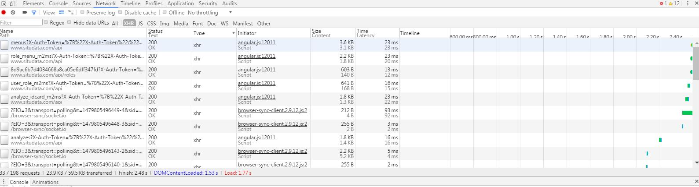  
  上面的每一项可以点击排序  
  点击某一请求，可以查看该请求的详细内容

  还可以根据类型过滤 如下图：  
    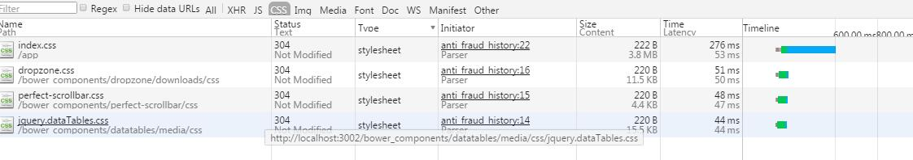  
    Network标签页对于分析网站请求的网络情况、查看某一请求的请求头和响应头还有响应内容很有用，特别是在查看Ajax类请求的时候，非常有帮助。注意是在你打开Chrome开发者工具后发起的请求，才会在这里显示的哦。

  点击左侧某一个具体去请求URL，可以看到该请求的详细HTTP请求情况：  
    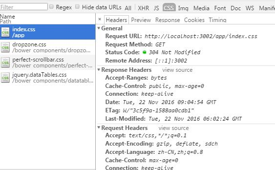  
    我们可以在这里看到HTTP请求头、HTTP响应头、HTTP返回的内容等信息，对于开发、调试，都是很有用的。

* ### Timeline

  这个Timeline指的JS执行时间、页面元素渲染时间。他可以让你查看浏览器的渲染流程。解析代码、布局、绘制、合并渲染层。

* ### Profiles

  这个主要是做性能优化的，包括查看CPU执行时间与内存占用，检测CPU占用程度。

* ### Application

  这是原来的Resource板块，这里存放着stroage，而且可以对其进行查看，增加，删除，修改。

* ### Audits

  这个对于优化前端页面、加速网页加载速度很有用，他会很智能的告诉你应该合并css、js以及某个css文件中unused CSS的百分比。  
  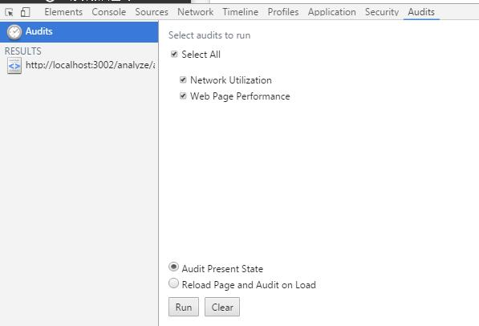  
  点击run按钮，就可以开始分析页面，分析完了就可以看到分析结果了：  
  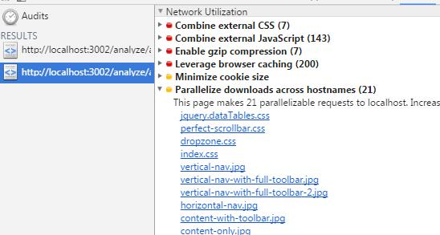  
  它甚至可以分析出页面上样式表中有哪些CSS是没有被使用的  
  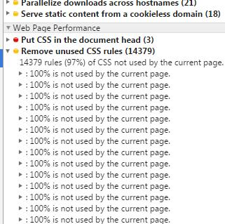

* ## 最后介绍一些常用技能：

* 在source板块下，文件可以被修改，并且支持版本回退。  
  打开一个文件，修改后保存。然后右键点击，选择Local Modifications,你可以看到保存记录，也可以选择回退。  
  -在source板块下，当你编辑文件的时候，可以按住ctrl同时修改多处

* Elements工具右侧css模块，最底部可以看到某个元素最终具体使用的字体

* 在console板块下，勾选console板块下的Preserve log来保存记录，这样就不会在每个页面加载之后清除数据，可以使用在当页面还没有加载完之前出现bug时。
* 颜色选择器 当在样式编辑中选择了一个颜色属性时，你可以点击颜色预览，就会弹出一个颜色选择器。当选择器开启时，如果你停留在页面，鼠标指针会变成一个放大镜，让你去选择像素精度的颜色
* Web浏览器在构建如文本框、按钮和输入框一类元素时，其它基本元素的视图是隐藏的。不过，你可以在Settings -&gt; General 中切换成Show user agent shadow DOM，这样就会在元素标签页中显示被隐藏的代码。甚至还能单独设计他们的样式，这给你了很大的控制权


