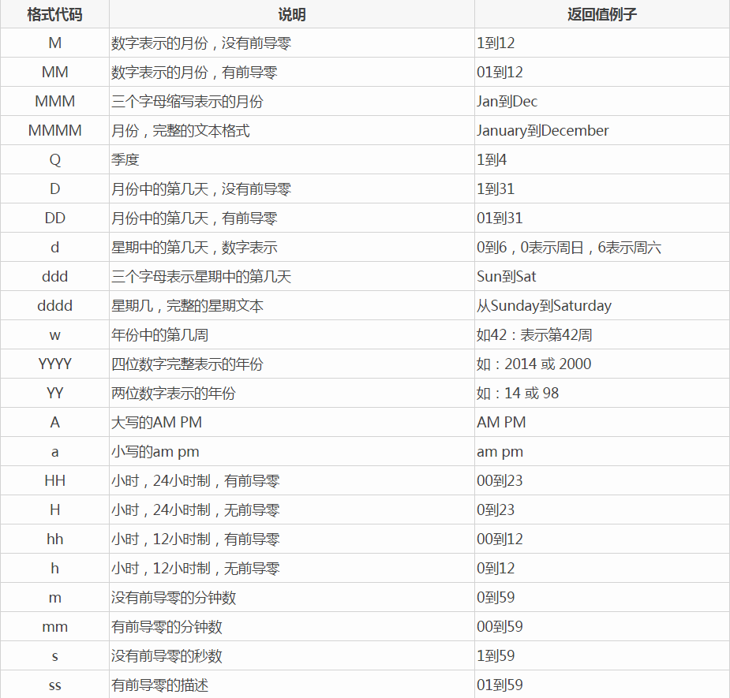
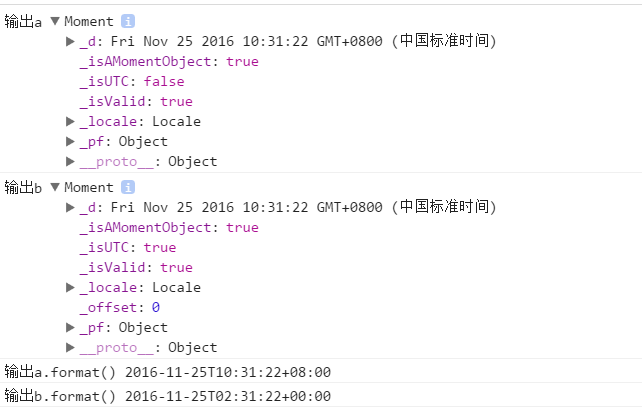
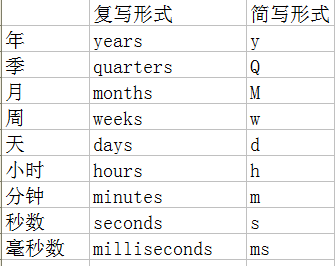
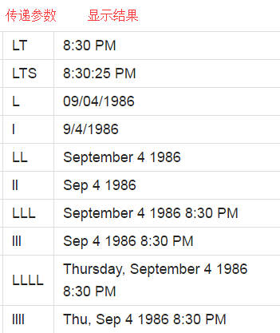

#Moment

#### 作者：王洪伟

#### 邮箱：wanghongwei@haomo-studio.com
##简介：

moment是一个独立操作时间的类库

##一、起步

**1.需要引入的文件**

      只需要引入moment.js即
            
            
       也可利用托管的网址进行引入
           https://cdnjs.cloudflare.com/ajax/libs/moment.js/2.17.0/moment.min.js
           
           
**2.我们需要了解的字符以及它代表的意义**

##二、时间解析标准

**1.解析iso 8601（怎么解析你输入的时间，方式  方法 iso  8601字符串）**
      
iso 8601是国际标准化组织的国际标准ISO 8601是日期和时间的表示方法，全称为《数据存储和交换形式·信息交换·日期和时间的表示方法》。目前最新为第三版ISO8601:2004，第一版为ISO8601:1988，第二版为ISO8601:2000 （详见百度百科）
例如：moment('2013-039'),会解析为2013年的第39天；
moment('2013-W06-5')，会解析为2013年第6个星期的第5天

**2.用时间加字符串的方式让浏览器去解析**

  moment还提供了一些更好理解的解析方式例如：
  
  moment('2010-10-11','YYYY-MM-DD')会解析为2010年10（月份是从0开始算的即0表示1月）月11日；当我们把MM与DD换下位置时moment('2010-10-11','YYYY-DD-MM'),便会解析为2010年10月11日(注：年份不是只能放在最前面)。
  
强大的moment是不可能只输出年月日的，例如moment('2010-10-20 4:30','YYYY-MM-DD HH:mm'),会解析为2010年10月20日4点30分，
       但是moment的输出不仅限于此还有时区（Z）、秒（s）等（详见moment参考文档（ http://momentjs.cn/docs/#/parsing/string/ ）解析中的字符串加格式部分）。
       
**3.当我们遇到错误时**
          
当我们在不知道2010年不是闰年的情况下向浏览器输入以下信息：

          moment('2010-02-29','YYYY-MM-DD')
很明现我们是想告诉浏览器我们要取到2010年2月的最后一天，虽然这是个错误的日期但是moment会把它正确解析为2010年3月1日也有的时候我们把月份和日期写反了而导致moment解析出来的与我们想要的结果不同时我们可以用isValid()来判断我们输入的时间字符串是否严格按照我们的格式字符串去解析的即：月份就是月份日期就是日期；并不会存在只要超出进制就会自动进一的情况

    moment("2010 13",           "YYYY MM").isValid();     // false (一年中只有12个月份)
    moment("2010 11 31",        "YYYY MM DD").isValid();  // false (十一月没有31日)
    moment("2010 2 29",         "YYYY MM DD").isValid();  // false (2010年不是闰年)
    moment("2010 notamonth 29", "YYYY MMM DD").isValid(); // false (not a real month name)
    
    很显然当我们用第三个参数（'fr'）告诉moment用法语进行解析时；我们得到了令我们满意的结果。
**4.怎么避免上面的日期与月份颠倒的错误**

当我们不确定我们的时间字符串中得月份与日期那个在前面时但是我们却知道他格式的大致类型，这个时候我们可以把格式字符串以数组的形式传递多个

    moment("29-06-1995", ["MM-DD-YYYY", "DD-MM", "DD-MM-YYYY"]); //解析结果为1995年6月29日
    moment("05-06-1995", ["MM-DD-YYYY", "DD-MM-YYYY"]);          //解析结果为1995年5月6日
上述两行代码中，第一行诠释了当我们的格式字符串为多个数组时他会依次的去进行匹配直到找到与时间字符串相符的那个字符串，然后根据该字符串进行解析；虽然第一行代码给了我们完美的答案，但是当我们的日期29是小于十二的时候那么他会像第二段代码那样执行，即遇到合适的就不进行往下匹配了（由于这个原因个人建议谨慎使用）
除了上述向moment传递参数让moment解析你想要的结果我们还可以用对象的方式进行传递

     moment({ hour:15, minute:10 });
     moment({ y    :2010, M     :3, d   :5, h    :15, m      :10, s      :3, ms          :123});
     moment({ year :2010, month :3, day :5, hour :15, minute :10, second :3, millisecond :123});
     moment({ years:2010, months:3, days:5, hours:15, minutes:10, seconds:3, milliseconds:123});
     moment({ years:2010, months:3, date:5, hours:15, minutes:10, seconds:3, milliseconds:123});
     
     
也可以通过Unix时间戳进行获取你想要的时间

    moment(1318781876406);   //以毫秒为单位  获取距1970年1月1日上午12点后1318781876406毫秒的时间信息
    moment.unix(1318781876); //以秒为单位  获取距1970年1月1日上午12点后1318781876秒的时间信息
    
也可用数组的方式进行传参

            [year, month, day, hour, minute, second, millisecond]
     moment([2010, 1, 14, 15, 25, 50, 125]); // 2010年1月14日15时25分50秒125毫秒

数组中得值是不能改变顺序的必须按照[年,月,日,小时,分钟,秒,毫秒]的方式进行传递
可少些但是moment会依据此数组的方式进行解析

有的时候因为后台语言不同因此ASP.NET旧版本的技术可能会返回与上述不符的字符串/Date(1198908717056)/或/Date(1198908717056-0700)/

如果是这样的字符串moment会正确的解析

    moment("/Date(1198908717056-0700)/");            // 2007年11月29日14时11分57秒
    moment("/Date(1198908717056-0700)/").isValid();  //true
    
    
    
    
    
**5.获取utc时间**

utc世界世界统一时间，我们可以用moment提供的utc()方法免去我们去计算当前utc时间的烦恼

    var a = moment();
    var b=moment.utc();
    console.log('输出a',a);
    console.log('输出b',b);
    console.log('输a.format()',a.format());  // 2013-02-04T10:35:24-08:00
    console.log('输出b.format()',b.format());  // 2013-02-04T18:35:24+00:00
    
    
输出结果
虽然输出a与b的_d的属性相同；
但是a.format(),与b.format()截然不同。
       
       
**6.当我们少输入参数时其余参数的默认值**

当我们指数入小时的时候

     var a=moment(5,'HH');//解析结果为当前时间的年月日5点整   2016-11-25T05:00:00+08:00
     
通过上述我们可以推断当我们传递某一个或多个参数时，它前面的参数会默认为本地的当前时间（日在小时之前，月在日之前  依此类推）之后的会显示为最小值;
##三、取值与赋值

**1.获取时间与部分的值**

    moment();//当前时间
    moment().illisecond();//当前毫秒数
    moment().second();//当前秒数
    moment().minute();//当前分钟数
    moment().hour();//当前小时数
    moment().date();//当前日期
    moment().day();//当前星期
    moment().month();//当前月份   
    moment().quarter();//当前季度
    moment().year();//当前年份
    
除了上述取值的方法外moment还提供了get()方法通过传参的方式来获取到对应的值

    moment().get('year');        //年
    moment().get('month');       //月0-11
    moment().get('date');        //日
    moemnt().get('hour');        //时
    moment().get('minute');      //分
    moment().get('second');      //秒
    moment().get('millisecond'); //毫秒
    
    
    

**2.给对应的时间/日期赋值**

moment还提供了moment().set的方法让我们随意的更改年、月、日...其中的某一个或多个的值

    moment().set('year',2013);         //把当前时间的年份改为2013年
    moment().set('month',3);           //更改月份
    moment().set('date', 1);           //更改日期
    moment().set('hour', 13);          //更改小时
    moment().set('minute', 20);        //更改分钟
    moment().set('second', 30);        //更改秒数 
    moment().set('millisecond', 123);  //更改毫秒数
    
我们不是只能更该某一个还可以利用对象的形式去更改任意的多个的值

    moment().set({'year': 2013, 'hour': 3});

**3.比较两个时间的大小**

moment还提供了min()和max()来筛选出最大或最小的值

例如：

    a=moment('2010 10 10','YYYY-MM-DD');
    b=moment('2010 10 09','YYYY-MM-DD');
    c=moment.max(a,b);
    console.log(c.format());  //输出结果为2012年10月10日
    
    
当我们比较两个时间的时候  其中有一个不是有效的时间是  即isValid()的值为false时max()与min()返回值也是false;所以我们不能输出有效的时间。
##四、时间的运算
  
**1.时间的加减法**

加法：

moment提供了moment().add()来改变我们在某一个值加多少,前面的值是多少后面的参数为我们要增加的是哪一个值   以天为例：

    var a=moment('2010 10 10','YYYY-MM-DD').add(7,'d');
    console.log(a.format());//2010年10月17日（2010年10月10日后的第七天）
    
    
当我们想让年增加时 只需把后面的参数d改为y对应见下表

    
我们虽然可以用链式操作来不断的增加不同的值  即：

    moment().add(7, 'days').add(1, 'months');//在增加完7天的基础上再增加1个月
    
    
但是momet提供了通过传对象的方式来更改更多的时间从而减少代码量 即：

    moment().add({days:7,months:1});//在增加7天的基础上再增加一分钟（与上面的解析结果一样）
    
    
    
    
##五、控制时间的显示形式

moment提供了format()来显示moment解析的最终结果；我们可以通过向format()来控制时间输出的格式，但是我们要遵守moment给我们指定的字符来获取对应的时间（详见第一章的字符定义）例如

    moment().format();//默认世界协调时间格式  2016-11-26T11:59:22+08:00
    moment().format('YYYY-MM-DD'); //输出2016-11-26
    
    
当我们少输入某个值时   比如我们在上述代码传参时只输入（'YY-MM'）时，他会输出16-11并不会输出日期部分;我们也可以加入更多的东西来输出更多的值

    moment().format('YYYY-MM-DD HH:mm');//2016-11-26 18:48
    
我们也可以改变年与日之间的‘-’来控制输出时年与月之间的字符比如

    moment().format('YYYY/MM/DD HH:mm');//2016/11/26 18:52
    moment().format('YYYY年MM月DD日 HH:mm');//2016年11月26日 18:52
    
format()除了上述参数外还可以传递一些预定已好的简单的参数
例如：

     moment.format('LT');  //会显示当前时间  即10:58 PM
     
预定义好的不只有LT还有一些别的 见下图

](zxc.png)

moment还允许我们修改这些简写形式输出的字符（详见：七、设置语言）。
##六、时间的判断
**1.是否在某个时间之前、之后、之间、相同**

moment提供了isBefore()\isSame()\isAfter()\isBetween()来判断某个时间是否在某个时间之前、相同、之后、之间并返回布尔值

    moment('2010-10-20').isisBefore('2010-10-21');              //true   2010年10月20日在2010年10月21日之前
    moment('2010-10-20').isSame('2010-10-20');                  //true 2010年10月10日与2010年10月10日相同
    moment('2010-10-20').isAfter('2010-10-21');                 //false  2010年10月20日不在2010年10月21日之后
    moment('2010-10-20').isBetween('2009-12-31','2010-11-10');  //true  2010年10月20日在2009年12月31日与2010年11月10日之间
**2.是否为moment日期对象**

moment提供了isMonment()来判断某个时间对象是否为moment对象并返回布尔值

    moment.isMoment(new Date())   // false   new Date()为javaScript对象
    moment.isMoment(moment())    // true  moment()为moment对象

**3.是否为js日期对象**

moment还提供了isDate()方法来判断某一对象是否为javaScript对象并返回布尔值

    moment.isDate(new Date());  //new Date为javaScript对象
##七、自定语言
moment允许我们设置我们应有的语言

      moment.locale('zh-cn', {  
        months : '一月_二月_三月_四月_五月_六月_七月_八月_九月_十月_十一月_十二月'.split('_'),  
        monthsShort : '1月_2月_3月_4月_5月_6月_7月_8月_9月_10月_11月_12月'.split('_'),  
        weekdays : '星期日_星期一_星期二_星期三_星期四_星期五_星期六'.split('_'),  
        weekdaysShort : '周日_周一_周二_周三_周四_周五_周六'.split('_'),  
        weekdaysMin : '日_一_二_三_四_五_六'.split('_'),  
        longDateFormat : {  
            LT : 'Ah点mm分',  
            LTS : 'Ah点m分s秒',  
            L : 'YYYY-MM-DD',  
            LL : 'YYYY年MMMD日',  
            LLL : 'YYYY年MMMD日Ah点mm分',  
            LLLL : 'YYYY年MMMD日ddddAh点mm分',  
            l : 'YYYY-MM-DD',  
            ll : 'YYYY年MMMD日',  
            lll : 'YYYY年MMMD日Ah点mm分',  
            llll : 'YYYY年MMMD日ddddAh点mm分'  
        },  
        meridiemParse: /凌晨|早上|上午|中午|下午|晚上/,  
        meridiemHour: function (hour, meridiem) {  
            if (hour === 12) {  
                hour = 0;  
            }  
            if (meridiem === '凌晨' || meridiem === '早上' ||  
                    meridiem === '上午') {  
                return hour;  
            } else if (meridiem === '下午' || meridiem === '晚上') {  
                return hour + 12;  
            } else {  
                // '中午'  
                return hour >= 11 ? hour : hour + 12;  
            }  
        },  
        meridiem : function (hour, minute, isLower) {  
            var hm = hour * 100 + minute;  
            if (hm < 600) {  
                return '凌晨';  
            } else if (hm < 900) {  
                return '早上';  
            } else if (hm < 1130) {  
                return '上午';  
            } else if (hm < 1230) {  
                return '中午';  
            } else if (hm < 1800) {  
                return '下午';  
            } else {  
                return '晚上';  
            }  
        },  
        calendar : {  
            sameDay : function () {  
                return this.minutes() === 0 ? '[今天]Ah[点整]' : '[今天]LT';  
            },  
            nextDay : function () {  
                return this.minutes() === 0 ? '[明天]Ah[点整]' : '[明天]LT';  
            },  
            lastDay : function () {  
                return this.minutes() === 0 ? '[昨天]Ah[点整]' : '[昨天]LT';  
            },  
            nextWeek : function () {  
                var startOfWeek, prefix;  
                startOfWeek = moment().startOf('week');  
                prefix = this.unix() - startOfWeek.unix() >= 7 * 24 * 3600 ? '[下]' : '[本]';  
                return this.minutes() === 0 ? prefix + 'dddAh点整' : prefix + 'dddAh点mm';  
            },  
            lastWeek : function () {  
                var startOfWeek, prefix;  
                startOfWeek = moment().startOf('week');  
                prefix = this.unix() < startOfWeek.unix()  ? '[上]' : '[本]';  
                return this.minutes() === 0 ? prefix + 'dddAh点整' : prefix + 'dddAh点mm';  
            },  
            sameElse : 'LL'  
        },  
        ordinalParse: /\d{1,2}(日|月|周)/,  
        ordinal : function (number, period) {  
            switch (period) {  
            case 'd':  
            case 'D':  
            case 'DDD':  
                return number + '日';  
            case 'M':  
                return number + '月';  
            case 'w':  
            case 'W':  
                return number + '周';  
            default:  
                return number;  
            }  
        },  
        relativeTime : {  
            future : '%s内',  
            past : '%s前',  
            s : '几秒',  
            m : '1 分钟',  
            mm : '%d 分钟',  
            h : '1 小时',  
            hh : '%d 小时',  
            d : '1 天',  
            dd : '%d 天',  
            M : '1 个月',  
            MM : '%d 个月',  
            y : '1 年',  
            yy : '%d 年'  
        },  
        week : {  
            // GB/T 7408-1994《数据元和交换格式·信息交换·日期和时间表示法》与ISO 8601:1988等效  
            dow : 1, // Monday is the first day of the week.  
            doy : 4  // The week that contains Jan 4th is the first week of the year.  
        }  
    });  
    
    var a=moment().format('LT');
    moment.locale('zh-cn');
    console.log(a);//晚上11点32分(默认为11:32 PM);
    
    
    
当我们设置好我们想要的语言之后moment会遵循我们已设置好的语言去输出.

##八、其他的日期处理类库

**1. XDate**

  
这个类库是javascript本地日期对象的封装，提供了加强的方法来帮助你解析，格式化和日期处理。 

**3. JavaScript Pretty Date**

一个简单有效的处理老式javascript日期的类库。例如，帮助你将“2012-04-
08T08:24:17Z” 处理成“2小时前”。非常适合发布帖子时构建人性化日期格式。

**5. Countdown JS**

精准计算两个日期之间的时间差

