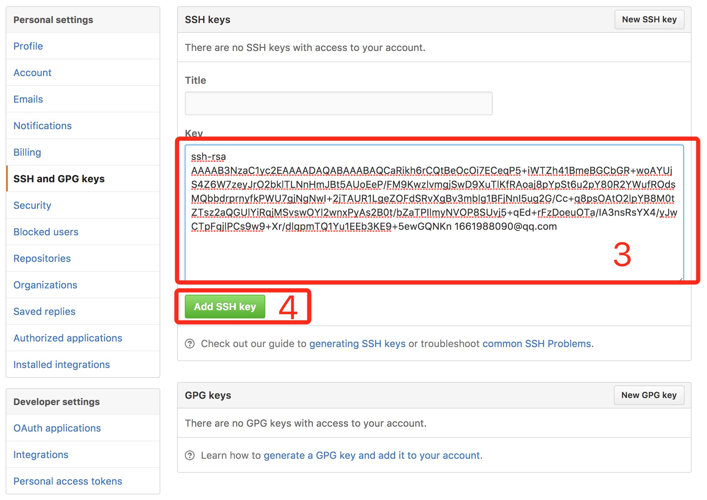

# GIt

#### 作者：杨柠瑞

#### 邮箱：yangnr@haomo-studio.com

## 1.简介

Git是一款开源的分布式版本控制系统，用于敏捷高效地处理任何或小或大的项目。

## 2.安装配置

* 下载地址：[https://git-scm.com/downloads](https://git-scm.com/downloads); 
* 完成安装后可在终端使用git --version或者which git命令，如果显示版本或是git安装目录说明已安装成功;
* 创建一个用户名和邮箱 &lt; 图1 \(1\) &gt; \(--global为全局的邮箱和用户名，如果想在指定目录添加，需在被添加目录先创建git的本地仓库\(git init\)\)：

  ```
    git config --global user.name "Your Name"
    git config --global user.email "email@example.com" 
  ```

* 配置 SSH key

  * 使用ssh-keygen命令生成key &lt; 图1 \(2\) &gt;

    ```
      ssh-keygen -t rsa -C "YourEmail"
    ```

  * 生成成功后可以看到.shh目录下有id\_rsa、id\_rsa.pub、known\_hosts三个文件 &lt; 图1 \(3\) &gt; ，我们需要的是公钥id\_rsa.pub。查看所生成的key:

    ```
      cat id_rsa.pub 
    ```

    


* 将SSH key添加到GitHub。
  * 登录到GitHub页面，点击Settings 
    
  * SSH and GPG keys \(1\)
  * New SSH key \(2\)
    
  * 将生成的key\(id\_rsa.pub文件）内容copy到输入框（3）中,点击Add SHH key（4）.
    


## 3.Clone 项目

> 在此使用SSH clone 项目

如果您没有本地仓库，请先在您想要放置项目的目录使用（ git init ）新建本地仓库。如果有本地仓库直接使用 \( git clone \) 将项目克隆到本地,如图：


## 4.常用命令

```
git add .   //添加当前目录的所有文件到暂存区
git commit -m "message"  //提交暂存区到仓库区 message为提交信息
git push  //将当前本地仓库的内容提交到远程仓库
git pull  // 取回远程仓库的变化，并与本地分支合并
git checkout .  //恢复暂存区的所有文件到工作区
git status  //显示有变更的文件
git branch    //新建本地分支
git push origin [branch]    //新建远程分支（前提是本地有此分支）
git branch --track [branch] [remote-branch]  //新建一个分支，与指定的远程分支建立追踪关系
git branch -d [branch-name]  //删除分支

git stash	//暂时将未提交的变化移除
git stash pop		//移入暂时移除的变化
```

了解命令后我们来看一下git是怎样同步代码的  


* Workspace：工作区 
* Index / Stage：暂存区
* Repository：仓库区（或本地仓库）
* Remote：远程仓库


