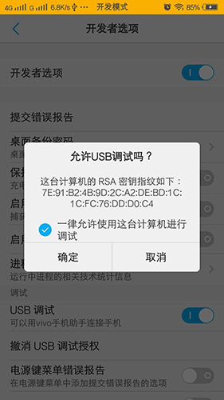
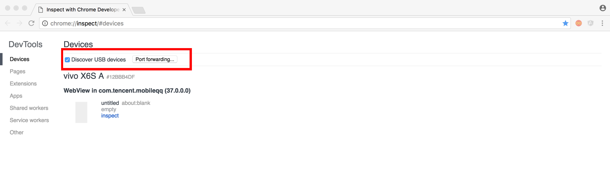

# 3.6.4 Chrome RemoteDebugging

#### 作者：杨柠瑞

#### 邮箱：yangnr@haomo-studio.com

###Chrome RemoteDebugging? 是以Chrome浏览器为平台的Android App调试工具

###要求  

在开始远程调试之前，您需要  

- 安装Chrome 32或更高的版本
- Android 4.0+的移动设备

###支持
- 调试站点的页面
- 调试安卓原生App中的WebView
- 实时将安卓设备的屏幕图像同步显示到开发机器
- 通过端口转发（port forwarding）与虚拟主机映射（virtual host mapping）实现安卓移动设备与开发服务器进行交互调试

###1.Android设备调试前准备
1.1、开启USB调试

- Android 4.0~ Android 4.1 ，打开设置 > 开发者选项 > 在“USB调试”处打钩选上。
- Android 4.2+，打开设置 > 关于手机 > 连点“版本号”7次，返回上层就可以看到“开发者选项”显示出来了，在“USB调试”处打钩选上。

1.2、**用USB数据线连接设备** 连接成功后，你可能会在设备上看到一个弹框请求允许使用这台计算机通过USB调试,请点击确定。



1.3、直接在浏览器地址栏输入chrome://inspect 或者about:inspect ，打开后DevTools后，确保打钩选中Discover USB devices



如果USB连接成功，这时候我们可以看到移动设备的型号和设备上运行的页面和允许调试的WebView列表。找到需要调试的目标页面，点击inspect即可打开DevTools。

###2.配置
调试WebView需要满足安卓系统版本为Android 4.4+已上。并且需要再你的APP内配置相应的代码，在WebView类中调用静态方法setWebContentsDebuggingEnabled，如下  

```
if (Build.VERSION.SDK_INT >=Build.VERSION_CODES.KITKAT) {  
  
   WebView.setWebContentsDebuggingEnabled(true);  
  
} 
```
以上配置方法适用于安卓应用内所有的WebView情形。

如果你想只在debuggable为true时候允许WebView远程调试，请使用以下代码段：

```

if (Build.VERSION.SDK_INT>= Build.VERSION_CODES.KITKAT) {  
  
    if (0 != (getApplicationInfo().flags &=ApplicationInfo.FLAG_DEBUGGABLE))  
  
    { WebView.setWebContentsDebuggingEnabled(true);}  
  
  } 
```
###3.虚拟主机映射（Virtual hostmapping）
当你在localhost域名（或你的本地开发机器IP）下调试，端口转发很灵验。不过，如果你要使用自己定制的本地域名来调试那就不管用了。

如果你在使用一个仅能运行于特定白名单中的域名下的JavaScriptSDK，因此你在host文件中设置了如127.0.0.1 xxx.com这样的对应关系。或许你在Web服务器（MAMP，wamp，xampp等）用虚拟主机配置了个性的域名。

若是想让移动设备显示特定域名下页面内容，你需要使用上述的端口转发技术和代理服务器技术来实现。代理服务器可以将移动设备上的请求映射到主机的正确位置。

- **端口转发代理设置的步骤： **


1.  安装代理服务软件，在主机上搭建代理服务器。

2.  开启代理服务，并确保代理服务器运行的端口与Chrome端口转发所设端口不相同。

3.  Chrome浏览器打开“检查设备”chrome://inspect

4.  点击Port forwarding 弹出设置窗口。

5.  设备端口处填上安卓设备要监听的端口，如9000。

6.  主机IP处可以填写localhost:xxxx，比如localhost:9000

7.  勾选 Enableport forwarding

8.  点击Done按钮完成参数配置。


- **移动设备代理服务参数设置： **


1.  打开设置-WLAN（Settings> Wi-Fi）

2.  长按当前连接的无线网络（代理服务设置适用于每个无线网络）

3.  点击修改网络（Modify network）

4.  勾选高级选项（Advanced options），将显示设置项

5.  点击“代理”（Proxy）菜单选择“手动”（Manual）

6.  在“代理服务器主机名”（ Proxyhostname）处输入localhost或者127.0.0.1

7.  在“代理服务器端口”（Proxy port）处输入端口号，如9000

8.  点击保存（Save）。  

 

通过以上参数设置，移动设备上所有请求被转发到主机的代理服务器，代理服务器代表安卓移动设备来发送请求，使得发送到特定域名下的请求得到了合理的解析。现在你可以调试特定域名下的页面了。